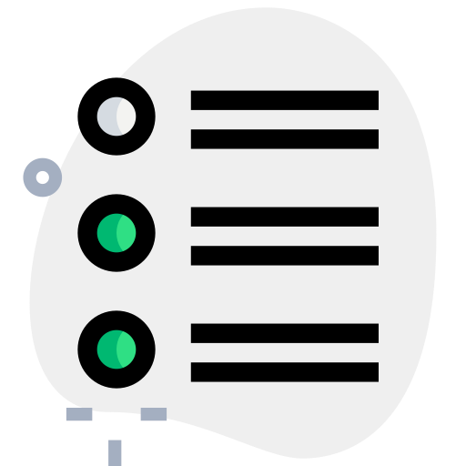
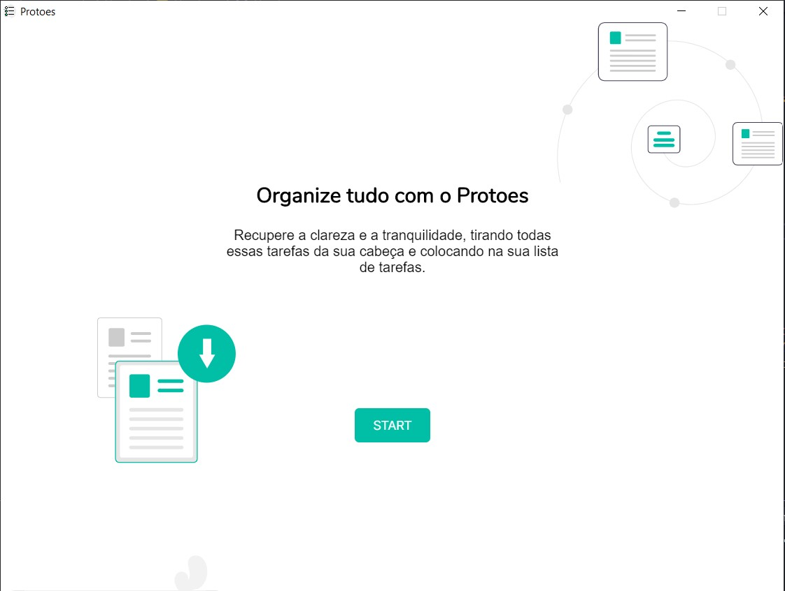
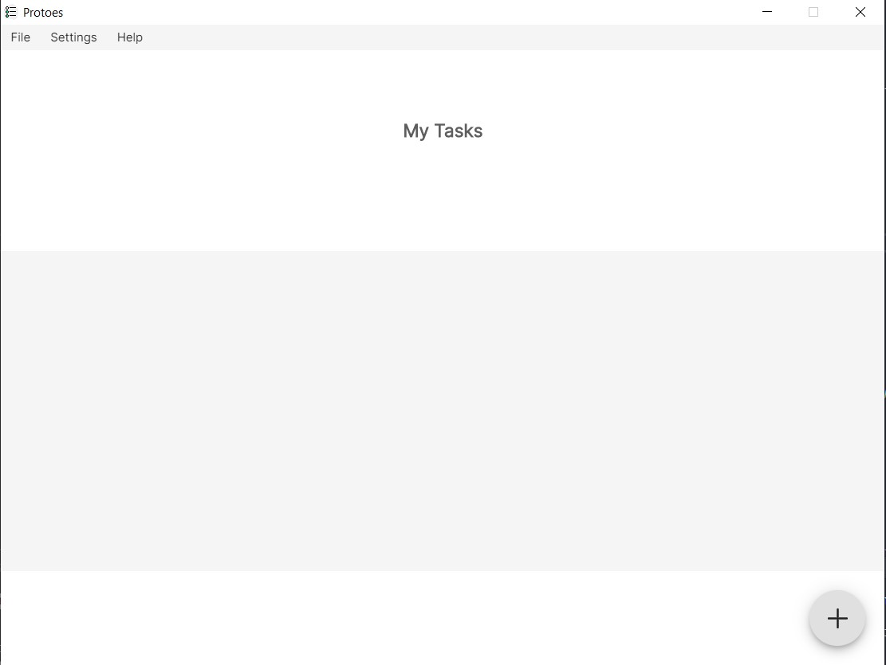
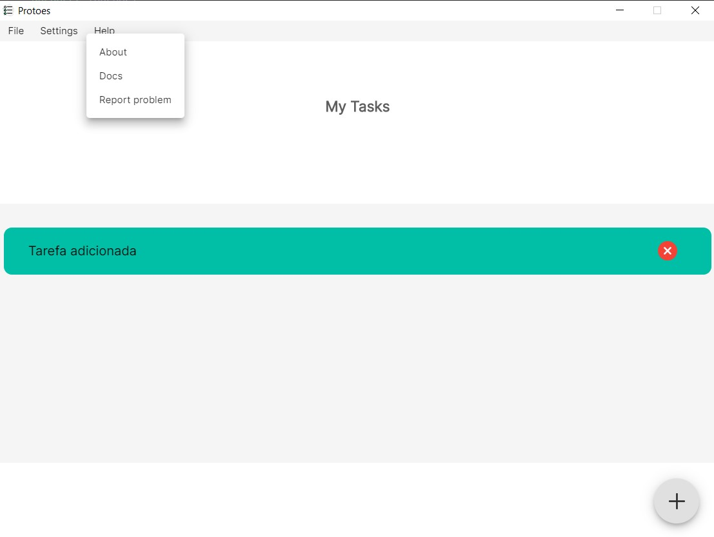

<h1 align="center">Protoes</h1> 

📌 Protoes is a simple and beautiful desktop application for task control.

## Tecnologias 👨‍💻
This project was developed with Electron.js, React.js and Material UI.
## Setup 🐱‍🏍

To run it on your machine it is necessary to have Node, already installed.
Install all project dependencies by running the `npm install` command on your terminal, in the project path.

Run the command `npm start`, and close the possible browser tab that will open automatically. And on another terminal run `npm dev`.
It is necessary that both scripts are being executed, for the application to be working.
## Guide 🎈

Landing Page para First Acess 🎇

Main Page 🎇

Visualization of Tasks 🎇

Menu 🎇

Add and remove your tasks 🎇

<strong>Espero que tenha gostado 🎈🎁</strong>

