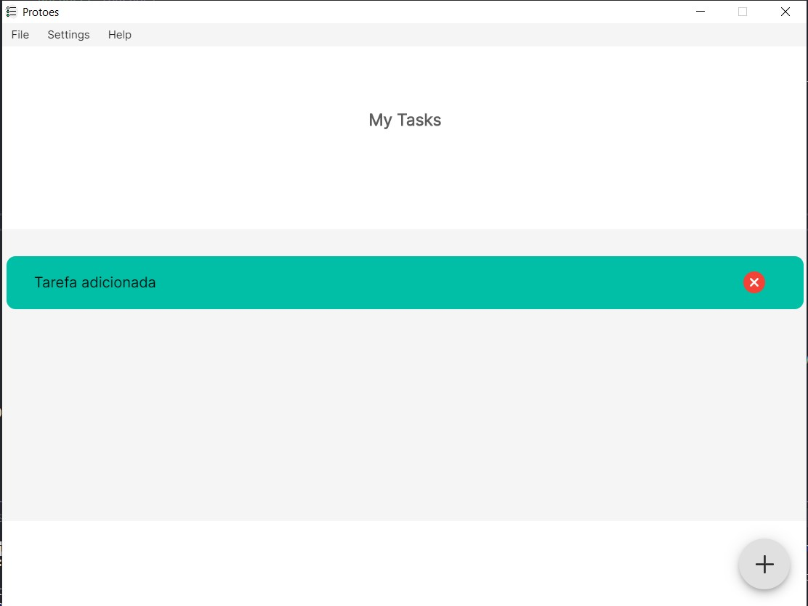

<h1 align="center">Protoes</h1> 

♦ Protoes é um simples e bonito aplicativo desktop para controle de tarefas.

## Tecnologias 👨‍💻
Este projeto foi desenvolvido com Electron.js, React.js e Material UI.
## Setup 🐱‍🏍

Para rodar ele em sua máquina é necessário ter o Node,js instalado.
Instale todas as dependências do projetos executando o comando `npm install` no seu terminal, no caminho do projeto.

Execute o comando `npm start`, e feche a possível aba do seu navegador que será aberta automaticamente. E em um outro terminal execute `npm dev`.
É necessário que os dois scripts estarem sendo executados para a aplicação estar funcionando.

## Guide 🎈

1 - 🎇Landing Page 

2 - 🎇Main Page

4 - 🎇Visualização das Tarevas

3 - 🎇Menu

4 - 🎇Adicione suas tarefas

